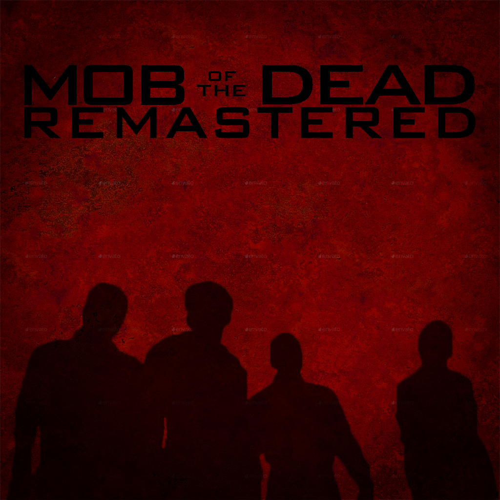
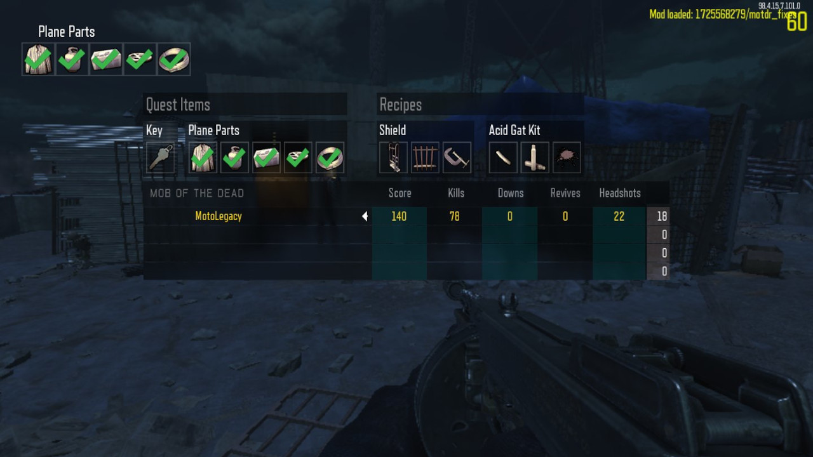
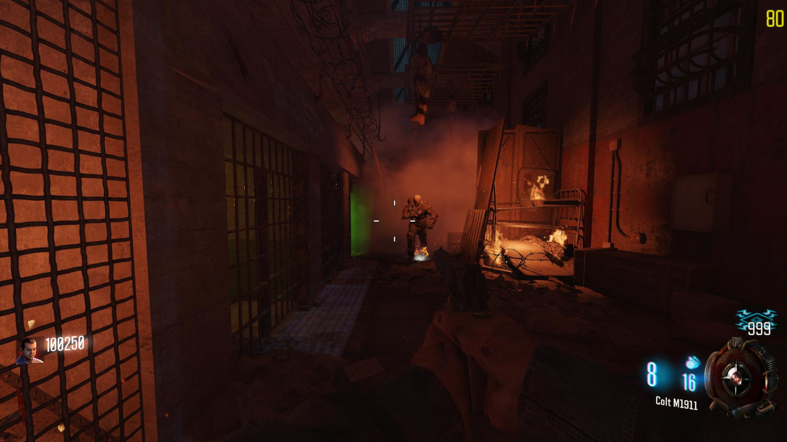
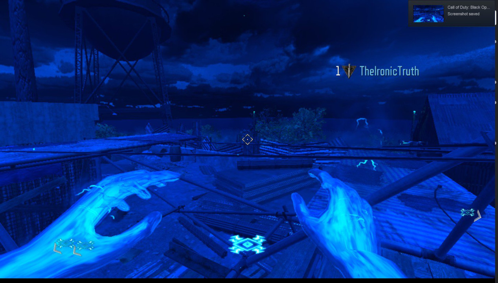
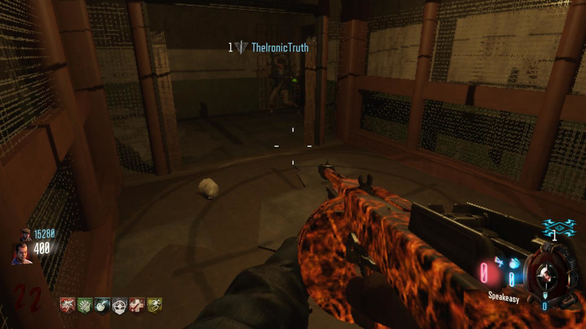

 
<h2 align="center"><b>Mob of the Dead Remastered Patch 1.3.2</b></h2>
<h4 align="center">A Patch for the Mob of the Dead Remastered Workshop Item</h4>

    <a href="#screenshots">Screenshots</a> &bull; 
    <a href="#about">About</a> &bull;
    <a href="#licensing">Licensing</a> &bull;
    <a href="#credits">Credits</a>

# Screenshots
⠀                    |  ⠀
:---------------------------:|:---------------------------:
     | 

⠀                      |  ⠀
:---------------------------:|:---------------------------:
     | 

# About
The following is the source/modtree, excluding raw audio and images, for the Call of Duty: Black Ops III Steam Workshop Item [Mob of the Dead Remastered Patch](https://steamcommunity.com/sharedfiles/filedetails/?id=1725568279), version 1.3.2. The repository will be updated to version 1.4.2 (latest) when possible.

# Licensing
All original source files are licensed under the [MIT License](https://opensource.org/licenses/MIT), however, source files based on decompilations of scripts from Call of Duty: Black Ops II will remain unlicensed, as they were written under the house of Activision Publishing, Inc. and Treyarch. You will be able to differentiate the two licenses by either analyzing the header above the source file or viewing the full list [here](licensed_scripts.txt).

# Credits

These are the credits specific to this patch, you can find the credits for the entire project, [Mob of The Dead Remastered](https://steamcommunity.com/workshop/filedetails/?id=1128166280), by clicking [here](extended_credits.txt).
<ul>
    <li>JariKCoding - LUI, Scripting, and General Assistance.</li>
    <li>Scobalula - Greyhound, HydraX, Husky, Attempts to overcome Asset Limits.</li>
    <li>TheIronicTruth - Initial Co-Op Testing</li>
    <li>Treyarch - Assets to extract, lol</li>
</ul>